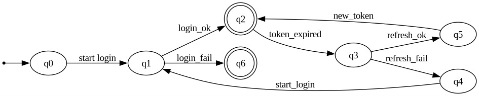

# AFN_LOGIN
### 📦 Conjunto de Estados (Q)

Q = { q0, q1, q2, q3, q4, q5, q6 }

- `q0`: Início (usuário não autenticado)
- `q1`: Login em andamento (credenciais enviadas)
- `q2`: Autenticado (Access Token válido)
- `q3`: Access Token expirado
- `q4`: Refresh Token falhou (deve logar novamente)
- `q5`: Novo Access Token gerado com sucesso
- `q6`: Falha definitiva (login ou refresh inválido)

---

### 🔡 Alfabeto de Entrada (Σ)

Σ = { start_login, login_ok, login_fail, token_expired, refresh_ok, refresh_fail, new_token }

- `start_login`: Ação de iniciar o login
- `login_ok`: Credenciais válidas
- `login_fail`: Credenciais inválidas
- `token_expired`: Access Token expirou
- `refresh_ok`: Refresh Token válido
- `refresh_fail`: Refresh Token inválido ou expirado
- `new_token`: Novo Access Token foi gerado

---

### 🔁 Função de Transição (δ)

A função δ: Q × Σ → Q define as transições entre estados. Abaixo estão as transições do autômato:

- δ(q0, start_login) → q1
- δ(q1, login_ok) → q2
- δ(q1, login_fail) → q6
- δ(q2, token_expired) → q3
- δ(q3, refresh_ok) → q5
- δ(q3, refresh_fail) → q4
- δ(q4, start_login) → q1
- δ(q5, new_token) → q2

--- 
### Sistema 

---

### Regras do sistema 
Uma interface de login será apresentada para o usuário, onde o citado deverá fazer uso das suas credenciais e autenticar-se. Segue o fluxo do sistema:
* O usuário acessa a página de login por meio do link;
* É necessário a inserção das credenciais de acesso, podendo gerar como resultado "sucesso" ou "falha";
  - Caso sucesso: um access token e um refresh token é enviado para o navegador do usuário. Os cookies serão armazenados como Cookie Read-Only para favorecer a segurança;
  - Caso falha: Mantém-se a tela de login como view principal.

* O usuário, a partir do momento da recepção do token, fica autenticado no sistema. Após algum tempo o access token estará expirado e será necessário o uso do refresh token para obter um novo access token; e
* Após algumas horas, o refresh token também ficará expirado, e quando acontecer o usuário será redirecionado para o 1º passo do fluxo (tela de login).
 
